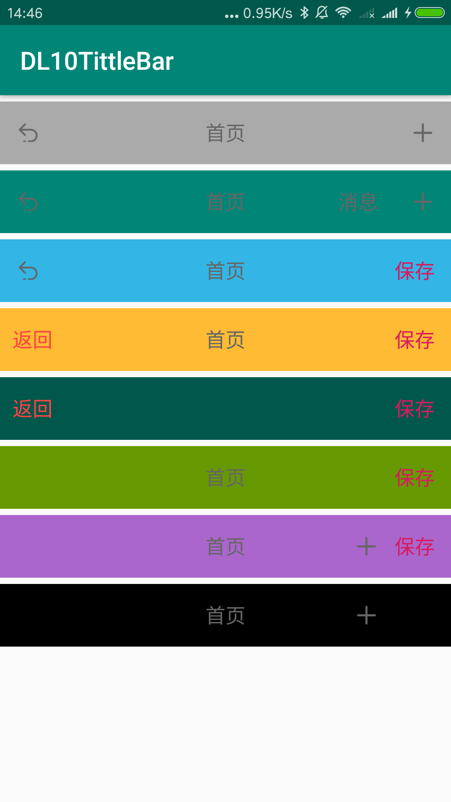

# DL10TittleBar
android 一款自定义Tittle Bar

说明链接：https://blog.csdn.net/sinat_38184748/article/details/88662476
# 效果图

# 使用方法
添加依赖

Step 1. Add it in your root build.gradle at the end of repositories:

```java
    allprojects {
    	repositories {
    		...
    		maven { url 'https://jitpack.io' }
    	}
    }
```

Step 2. Add the dependency
```java
	dependencies {
	        implementation 'com.github.D10NGYANG:DL10TittleBar:1.0.0'
	}
```
在布局上使用
```java
<com.dlong.rep.dltittlebar.DLTittleBar
        android:layout_width="match_parent"
        android:layout_height="50dp"
        android:layout_marginTop="5dp"
        app:barBackground="@color/colorPrimary"
        app:leftBtnImage="@drawable/back"
        app:leftBtnVisible="true"
        app:right1BtnTxt="消息"
        app:right1BtnVisible="true"
        app:right2BtnImage="@drawable/add"
        app:right2BtnVisible="true"
        app:tittleColor="#666666"
        app:tittleTxt="首页">

    </com.dlong.rep.dltittlebar.DLTittleBar>
```
